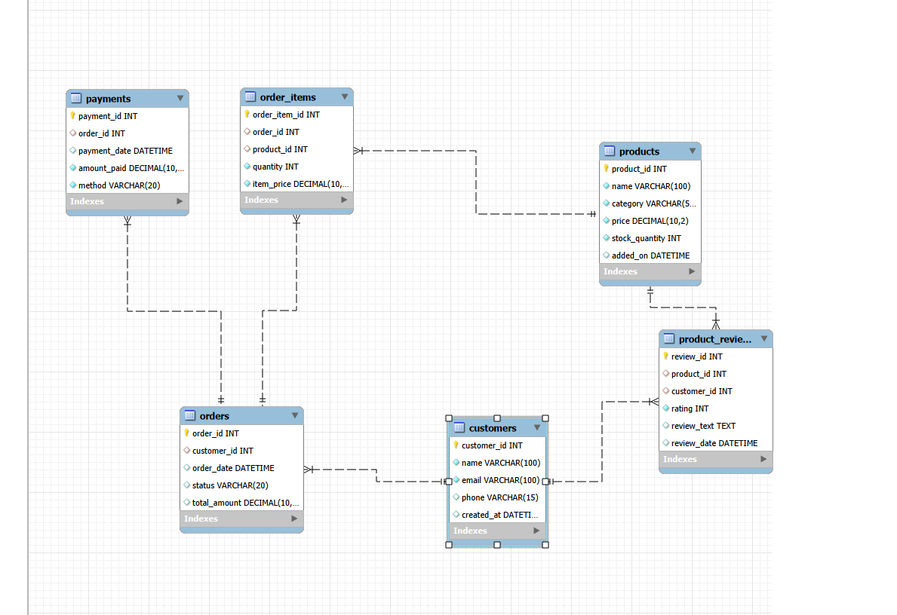

# Retail Shop Database Management using SQL

## Overview

Developed a Retail Shop Database Management project using MySQL to manage customer, product, order, and payment data. The project demonstrates practical SQL skills used in real-world business environments.

## Database Schema

## Key Features

* Customer and product data management
* Sales and revenue analysis
* Order tracking and reporting
* Inventory monitoring
* Customer activity analysis
* Business insight generation

## SQL Concepts Used

* SELECT Queries
* Filtering & Sorting
* Aggregate Functions
* GROUP BY & HAVING
* INNER JOIN, LEFT JOIN, RIGHT JOIN
* Subqueries
* Set Operations

## Business Insights

* Identified active and inactive customers
* Analyzed customer purchase behavior
* Tracked product performance
* Generated revenue and sales reports
* Supported business decision-making through SQL reporting

## Technologies

* MySQL
* SQL

## Skills Demonstrated

SQL | Database Management | Data Analysis | Business Reporting | Joins | Subqueries | Aggregations
